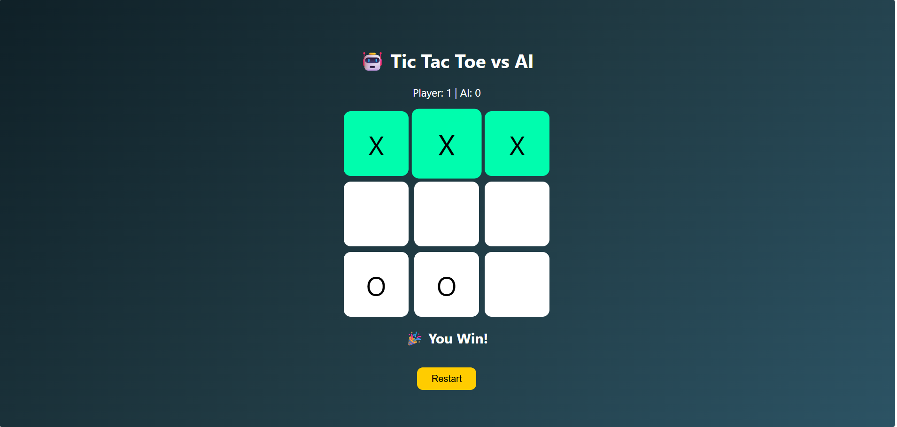

# 🎮 Responsive Tic Tac Toe Web App

An interactive Tic-Tac-Toe game built using HTML, CSS and JavaScript where users can play against an AI opponent.

## 🚀 Features

* AI opponent gameplay
* Responsive design (Mobile + Desktop)
* Smooth hover animations
* Sound effects
* Scoreboard tracking
* Restart game option

## 🛠️ Technologies Used

* HTML5
* CSS3
* JavaScript (DOM Manipulation)

## 🌐 Live Demo

https://varshahirem15-ui.github.io/responsive-tic-tac-toe/

## 📸 Project Screenshot

